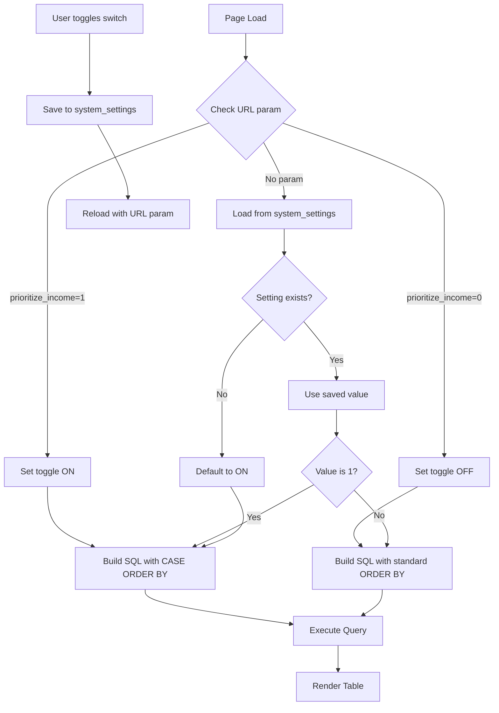

# Design Document: Credit Income Prioritization Toggle

## Overview

This feature adds a toggle control to the credit transactions page (`accounts/credit.php`) that allows users to prioritize income entries over expense entries in the transaction list. The toggle provides two sorting modes:

1. **Income-first mode (ON)**: Income transactions appear before expense transactions, with each group sorted by date descending
2. **Chronological mode (OFF)**: All transactions sorted by date descending regardless of type

The toggle state persists across sessions using the existing `system_settings` table, defaults to ON for all users, and is reflected in URL parameters for bookmarking and sharing.

## Architecture

### Component Structure

```
accounts/credit.php (Main File)
├── UI Layer
│   ├── Toggle switch control (checkbox input)
│   ├── Transaction table display
│   └── Pagination controls
├── Business Logic Layer
│   ├── Preference retrieval/storage
│   ├── URL parameter handling
│   └── Query construction
└── Data Layer
    ├── system_settings table (preference storage)
    └── ledger_entries table (transaction data)
```

### Data Flow



## Components and Interfaces

### 1. Toggle Switch UI Component

**Location**: Header section of credit transactions table, adjacent to "Show voided" checkbox

**HTML Structure**:
```html
<form method="GET" class="inline-flex items-center gap-2">
    <label class="inline-flex items-center gap-2 text-xs text-mb-subtle">
        <input type="checkbox" 
               name="prioritize_income" 
               value="1" 
               <?= $prioritizeIncome ? 'checked' : '' ?>
               onchange="this.form.submit()"
               class="accent-mb-accent w-4 h-4 rounded border border-mb-subtle/30 bg-mb-black">
        Prioritize income
    </label>
    <?php if ($includeVoided): ?>
        <input type="hidden" name="include_voided" value="1">
    <?php endif; ?>
</form>
```

**Behavior**:
- Checkbox state reflects current `$prioritizeIncome` variable
- On change, form submits via GET request
- Preserves other query parameters (include_voided, page)

### 2. Preference Management

**Storage Key**: `credit_prioritize_income`

**Functions**:

```php
/**
 * Get the prioritize income preference for credit transactions.
 * 
 * @param PDO $pdo Database connection
 * @return bool True if income should be prioritized, false otherwise
 */
function get_credit_prioritize_income(PDO $pdo): bool {
    $value = settings_get($pdo, 'credit_prioritize_income', '1');
    return $value === '1';
}

/**
 * Save the prioritize income preference for credit transactions.
 * 
 * @param PDO $pdo Database connection
 * @param bool $prioritize Whether to prioritize income
 */
function set_credit_prioritize_income(PDO $pdo, bool $prioritize): void {
    settings_set($pdo, 'credit_prioritize_income', $prioritize ? '1' : '0');
}
```

**Integration**: These functions will be added to `includes/settings_helpers.php`

### 3. URL Parameter Handling

**Parameter Name**: `prioritize_income`

**Values**:
- `1` = Income prioritization ON
- `0` or absent = Use saved preference or default

**Resolution Logic**:
```php
// 1. Check URL parameter first
if (isset($_GET['prioritize_income'])) {
    $prioritizeIncome = $_GET['prioritize_income'] === '1';
    // Save preference when explicitly set via URL
    set_credit_prioritize_income($pdo, $prioritizeIncome);
} else {
    // 2. Fall back to saved preference (defaults to true)
    $prioritizeIncome = get_credit_prioritize_income($pdo);
}
```

### 4. SQL Query Modification

**Current Query** (lines 95-97 in credit.php):
```php
$selectSql = "SELECT le.*, r.id AS res_id, r.status AS res_status, c.name AS client_name, c.id AS client_id, c.phone AS client_phone, u.name AS posted_by_name" . $baseSql . " ORDER BY le.id DESC, le.posted_at DESC";
```

**Modified Query** (when prioritize_income is ON):
```php
$orderClause = $prioritizeIncome 
    ? " ORDER BY CASE WHEN le.txn_type = 'income' THEN 0 ELSE 1 END, le.posted_at DESC, le.id DESC"
    : " ORDER BY le.id DESC, le.posted_at DESC";

$selectSql = "SELECT le.*, r.id AS res_id, r.status AS res_status, c.name AS client_name, c.id AS client_id, c.phone AS client_phone, u.name AS posted_by_name" . $baseSql . $orderClause;
```

**CASE Expression Explanation**:
- `CASE WHEN le.txn_type = 'income' THEN 0 ELSE 1 END` assigns:
  - `0` to income entries (sorted first)
  - `1` to expense entries (sorted second)
- Within each group, entries are sorted by `posted_at DESC` (newest first)
- `le.id DESC` provides stable ordering for entries with identical timestamps

### 5. Pagination Integration

**Current Pagination Call**:
```php
echo render_pagination($pg, $includeVoided ? ['include_voided' => '1'] : []);
```

**Modified Pagination Call**:
```php
$paginationParams = [];
if ($includeVoided) {
    $paginationParams['include_voided'] = '1';
}
if ($prioritizeIncome) {
    $paginationParams['prioritize_income'] = '1';
}
echo render_pagination($pg, $paginationParams);
```

This ensures the toggle state persists across page navigation.

## Data Models

### system_settings Table

**Existing Schema** (from settings_helpers.php):
```sql
CREATE TABLE IF NOT EXISTS system_settings (
    `key` VARCHAR(100) NOT NULL PRIMARY KEY,
    `value` TEXT DEFAULT NULL,
    updated_at TIMESTAMP DEFAULT CURRENT_TIMESTAMP ON UPDATE CURRENT_TIMESTAMP
) ENGINE=InnoDB
```

**New Entry**:
- **Key**: `credit_prioritize_income`
- **Value**: `'1'` (ON) or `'0'` (OFF)
- **Default**: `'1'` (income prioritization enabled)

### ledger_entries Table

**Relevant Columns**:
- `id` (INT, PRIMARY KEY)
- `txn_type` (VARCHAR, values: 'income' or 'expense')
- `posted_at` (TIMESTAMP)
- `payment_mode` (VARCHAR, filtered to 'credit')
- `voided_at` (TIMESTAMP, NULL for active entries)

**No schema changes required** - existing columns support the feature.


## Correctness Properties

*A property is a characteristic or behavior that should hold true across all valid executions of a system—essentially, a formal statement about what the system should do. Properties serve as the bridge between human-readable specifications and machine-verifiable correctness guarantees.*

### Property 1: Income-First Ordering

*For any* list of credit transactions when prioritization is enabled, every income entry must appear before every expense entry in the result set.

**Validates: Requirements 2.1**

### Property 2: Within-Group Chronological Sorting

*For any* list of credit transactions when prioritization is enabled, all entries of the same transaction type (income or expense) must be sorted by posted_at in descending order (newest first).

**Validates: Requirements 2.2, 2.3**

### Property 3: Pure Chronological Sorting

*For any* list of credit transactions when prioritization is disabled, all entries must be sorted by posted_at in descending order regardless of transaction type.

**Validates: Requirements 2.4**

### Property 4: Filter Independence

*For any* combination of prioritization toggle state and voided filter state, changing the prioritization toggle must not affect which entries are included based on their voided status, and vice versa.

**Validates: Requirements 2.5**

### Property 5: Preference Persistence Round-Trip

*For any* toggle state (ON or OFF), if the state is set via URL parameter and saved, then loading the page without the URL parameter must reflect the previously saved state.

**Validates: Requirements 3.1**

### Property 6: Pagination Parameter Preservation

*For any* page in the transaction list when prioritization is enabled, all pagination links must include the prioritize_income=1 parameter.

**Validates: Requirements 3.5**

## Error Handling

### Invalid URL Parameters

**Scenario**: User manually edits URL with invalid prioritize_income value (e.g., `prioritize_income=abc`)

**Handling**:
```php
$prioritizeIncome = isset($_GET['prioritize_income']) && $_GET['prioritize_income'] === '1';
```
- Any value other than exactly `'1'` is treated as OFF
- No error message needed - graceful degradation to OFF state

### Database Connection Failure

**Scenario**: Unable to read/write preference to system_settings table

**Handling**:
- Preference read failure: Fall back to default (ON)
- Preference write failure: Continue with current state, log error
- User experience is not disrupted

**Implementation**:
```php
try {
    set_credit_prioritize_income($pdo, $prioritizeIncome);
} catch (Throwable $e) {
    app_log('ERROR', 'Failed to save credit prioritization preference: ' . $e->getMessage());
    // Continue execution - preference will be saved on next successful attempt
}
```

### Missing system_settings Table

**Scenario**: Table doesn't exist (fresh installation or migration issue)

**Handling**:
- `settings_ensure_table()` is called by `settings_get()` and `settings_set()`
- Table is created automatically on first access
- No user-facing error

## Testing Strategy

### Unit Testing Approach

Unit tests will focus on specific examples and edge cases:

1. **Default State Test**: Verify that when no preference exists, the toggle defaults to ON
2. **URL Parameter Parsing**: Test that `prioritize_income=1` sets toggle ON, and `prioritize_income=0` or absent uses saved preference
3. **Preference Storage**: Test that `set_credit_prioritize_income()` correctly stores '1' or '0' in system_settings
4. **Preference Retrieval**: Test that `get_credit_prioritize_income()` correctly interprets stored values
5. **Pagination Link Generation**: Test that pagination links include correct query parameters

### Property-Based Testing Approach

Property-based tests will verify universal properties across randomized inputs using **PHPUnit with Eris** (property-based testing library for PHP).

**Configuration**: Each property test will run a minimum of 100 iterations with randomized data.

**Test Structure**:
```php
use Eris\Generator;
use Eris\TestTrait;

class CreditPrioritizationPropertyTest extends TestCase
{
    use TestTrait;
    
    // Property tests here
}
```

#### Property Test 1: Income-First Ordering

**Feature: credit-income-prioritization-toggle, Property 1: For any list of credit transactions when prioritization is enabled, every income entry must appear before every expense entry in the result set.**

```php
public function testIncomeEntriesAppearBeforeExpenseEntries()
{
    $this->forAll(
        Generator\seq(Generator\associative([
            'txn_type' => Generator\elements('income', 'expense'),
            'posted_at' => Generator\date('Y-m-d H:i:s'),
            'amount' => Generator\float(0.01, 10000.00),
        ]))
    )->then(function ($transactions) {
        // Apply income-first sorting
        $sorted = $this->applyCreditSorting($transactions, true);
        
        // Find last income index and first expense index
        $lastIncomeIndex = -1;
        $firstExpenseIndex = PHP_INT_MAX;
        
        foreach ($sorted as $index => $txn) {
            if ($txn['txn_type'] === 'income') {
                $lastIncomeIndex = $index;
            } elseif ($txn['txn_type'] === 'expense' && $firstExpenseIndex === PHP_INT_MAX) {
                $firstExpenseIndex = $index;
            }
        }
        
        // Assert: last income comes before first expense
        if ($lastIncomeIndex >= 0 && $firstExpenseIndex < PHP_INT_MAX) {
            $this->assertLessThan($firstExpenseIndex, $lastIncomeIndex);
        }
    });
}
```

#### Property Test 2: Within-Group Chronological Sorting

**Feature: credit-income-prioritization-toggle, Property 2: For any list of credit transactions when prioritization is enabled, all entries of the same transaction type must be sorted by posted_at in descending order.**

```php
public function testWithinGroupChronologicalSorting()
{
    $this->forAll(
        Generator\seq(Generator\associative([
            'txn_type' => Generator\elements('income', 'expense'),
            'posted_at' => Generator\date('Y-m-d H:i:s'),
            'amount' => Generator\float(0.01, 10000.00),
        ]))
    )->then(function ($transactions) {
        $sorted = $this->applyCreditSorting($transactions, true);
        
        // Check income group is sorted by posted_at DESC
        $incomeEntries = array_filter($sorted, fn($t) => $t['txn_type'] === 'income');
        $this->assertChronologicalDescending(array_column($incomeEntries, 'posted_at'));
        
        // Check expense group is sorted by posted_at DESC
        $expenseEntries = array_filter($sorted, fn($t) => $t['txn_type'] === 'expense');
        $this->assertChronologicalDescending(array_column($expenseEntries, 'posted_at'));
    });
}

private function assertChronologicalDescending(array $dates): void
{
    for ($i = 0; $i < count($dates) - 1; $i++) {
        $this->assertGreaterThanOrEqual(
            strtotime($dates[$i + 1]),
            strtotime($dates[$i]),
            "Dates must be in descending order"
        );
    }
}
```

#### Property Test 3: Pure Chronological Sorting

**Feature: credit-income-prioritization-toggle, Property 3: For any list of credit transactions when prioritization is disabled, all entries must be sorted by posted_at in descending order regardless of transaction type.**

```php
public function testPureChronologicalSorting()
{
    $this->forAll(
        Generator\seq(Generator\associative([
            'txn_type' => Generator\elements('income', 'expense'),
            'posted_at' => Generator\date('Y-m-d H:i:s'),
            'amount' => Generator\float(0.01, 10000.00),
        ]))
    )->then(function ($transactions) {
        $sorted = $this->applyCreditSorting($transactions, false);
        
        // All entries should be sorted by posted_at DESC
        $dates = array_column($sorted, 'posted_at');
        $this->assertChronologicalDescending($dates);
    });
}
```

#### Property Test 4: Filter Independence

**Feature: credit-income-prioritization-toggle, Property 4: For any combination of prioritization toggle state and voided filter state, changing the prioritization toggle must not affect which entries are included based on their voided status.**

```php
public function testFilterIndependence()
{
    $this->forAll(
        Generator\seq(Generator\associative([
            'txn_type' => Generator\elements('income', 'expense'),
            'posted_at' => Generator\date('Y-m-d H:i:s'),
            'voided_at' => Generator\oneOf(
                Generator\constant(null),
                Generator\date('Y-m-d H:i:s')
            ),
        ])),
        Generator\bool()
    )->then(function ($transactions, $includeVoided) {
        // Apply sorting with prioritization ON
        $sortedOn = $this->applyCreditSorting($transactions, true, $includeVoided);
        
        // Apply sorting with prioritization OFF
        $sortedOff = $this->applyCreditSorting($transactions, false, $includeVoided);
        
        // Extract IDs (assuming we add an ID field)
        $idsOn = array_column($sortedOn, 'id');
        $idsOff = array_column($sortedOff, 'id');
        
        // Same entries should be present (just different order)
        sort($idsOn);
        sort($idsOff);
        $this->assertEquals($idsOn, $idsOff);
    });
}
```

#### Property Test 5: Preference Persistence Round-Trip

**Feature: credit-income-prioritization-toggle, Property 5: For any toggle state, if the state is set via URL parameter and saved, then loading the page without the URL parameter must reflect the previously saved state.**

```php
public function testPreferencePersistenceRoundTrip()
{
    $this->forAll(
        Generator\bool()
    )->then(function ($prioritizeIncome) {
        $pdo = $this->getTestDatabaseConnection();
        
        // Save preference
        set_credit_prioritize_income($pdo, $prioritizeIncome);
        
        // Retrieve preference
        $retrieved = get_credit_prioritize_income($pdo);
        
        // Assert round-trip equality
        $this->assertEquals($prioritizeIncome, $retrieved);
    });
}
```

#### Property Test 6: Pagination Parameter Preservation

**Feature: credit-income-prioritization-toggle, Property 6: For any page in the transaction list when prioritization is enabled, all pagination links must include the prioritize_income=1 parameter.**

```php
public function testPaginationParameterPreservation()
{
    $this->forAll(
        Generator\choose(1, 100), // page number
        Generator\bool()          // prioritize_income state
    )->then(function ($pageNumber, $prioritizeIncome) {
        $params = [];
        if ($prioritizeIncome) {
            $params['prioritize_income'] = '1';
        }
        $params['page'] = $pageNumber;
        
        // Generate pagination HTML
        $html = render_pagination([
            'page' => $pageNumber,
            'total_pages' => 10,
            'per_page' => 25,
            'total' => 250,
        ], $params);
        
        // If prioritization is ON, all links should contain the parameter
        if ($prioritizeIncome) {
            $this->assertStringContainsString('prioritize_income=1', $html);
            
            // Check that all page links include the parameter
            preg_match_all('/href="[^"]*"/', $html, $matches);
            foreach ($matches[0] as $link) {
                if (strpos($link, 'page=') !== false) {
                    $this->assertStringContainsString('prioritize_income=1', $link);
                }
            }
        }
    });
}
```

### Test Helper Function

```php
/**
 * Apply credit transaction sorting logic.
 * Mimics the SQL ORDER BY behavior in PHP for testing.
 */
private function applyCreditSorting(array $transactions, bool $prioritize, bool $includeVoided = true): array
{
    // Filter voided entries if needed
    $filtered = $includeVoided 
        ? $transactions 
        : array_filter($transactions, fn($t) => empty($t['voided_at']));
    
    // Sort based on prioritization mode
    usort($filtered, function ($a, $b) use ($prioritize) {
        if ($prioritize) {
            // First by type (income=0, expense=1)
            $typeA = $a['txn_type'] === 'income' ? 0 : 1;
            $typeB = $b['txn_type'] === 'income' ? 0 : 1;
            if ($typeA !== $typeB) {
                return $typeA - $typeB;
            }
        }
        
        // Then by posted_at DESC
        return strtotime($b['posted_at']) - strtotime($a['posted_at']);
    });
    
    return $filtered;
}
```

### Integration Testing

Integration tests will verify the complete flow:

1. **End-to-End Toggle Flow**: Load page → toggle switch → verify preference saved → reload → verify state persists
2. **URL Parameter Override**: Set preference to OFF → load with `?prioritize_income=1` → verify toggle is ON
3. **Pagination Flow**: Enable toggle → navigate to page 2 → verify toggle state maintained
4. **Combined Filters**: Enable both "Show voided" and "Prioritize income" → verify both filters work correctly

### Manual Testing Checklist

- [ ] Toggle switch appears in correct location
- [ ] Toggle defaults to ON for new users
- [ ] Clicking toggle reloads page with correct sorting
- [ ] Income entries appear before expense entries when ON
- [ ] Entries are chronologically sorted when OFF
- [ ] Preference persists after browser close/reopen
- [ ] Pagination links preserve toggle state
- [ ] Toggle works correctly with "Show voided" filter
- [ ] Bookmarking page with toggle ON works correctly
- [ ] Mobile responsive layout for toggle control
