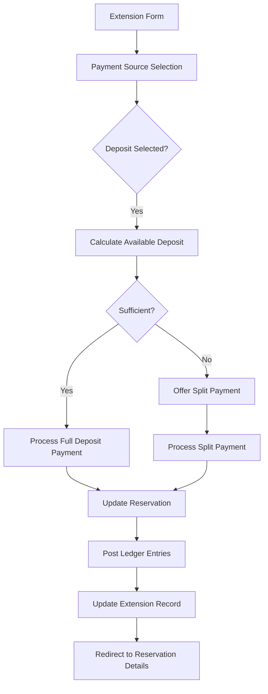

# Design Document: Extension Payment from Deposit

## Overview

This feature extends the reservation extension system to support paying for extensions using security deposit funds. Currently, extensions can only be paid via cash, credit, or account transfer. This design adds deposit as a payment source with support for split payments when the deposit is insufficient to cover the full extension amount.

The system will track deposit usage for extensions separately from damage deductions, ensuring accurate financial records and proper handling at return time. The implementation follows the existing patterns established in the codebase for deposit tracking (deposit_deducted, deposit_held) and ledger posting.

### Key Design Principles

1. **Graceful Degradation**: Code must work correctly before and after database migration using information_schema checks
2. **Ledger Consistency**: All deposit movements must be recorded in the ledger with proper categorization
3. **Idempotency**: Ledger posts use unique keys to prevent duplicate entries
4. **Split Payment Support**: Handle scenarios where deposit is insufficient for full extension amount
5. **Audit Trail**: Maintain complete history of how each extension was paid

## Architecture

### Component Interaction Flow



### Data Flow

1. **Extension Request**: User selects payment source on extend.php
2. **Validation**: System calculates available deposit and validates sufficiency
3. **Payment Processing**: System updates reservation.deposit_used_for_extension
4. **Extension Recording**: System stores payment details in reservation_extensions table
5. **Ledger Posting**: System posts expense (deposit out) and income (extension) entries
6. **Return Calculation**: System includes deposit_used_for_extension in remaining deposit calculation

## Components and Interfaces

### 1. Database Schema Changes

#### reservations Table

```sql
ALTER TABLE reservations 
ADD COLUMN IF NOT EXISTS deposit_used_for_extension DECIMAL(10,2) NOT NULL DEFAULT 0.00 
AFTER deposit_held;
```

This column tracks the cumulative deposit amount used across all extensions for this reservation.

#### reservation_extensions Table

```sql
ALTER TABLE reservation_extensions 
ADD COLUMN IF NOT EXISTS paid_from_deposit DECIMAL(10,2) NOT NULL DEFAULT 0.00 AFTER amount,
ADD COLUMN IF NOT EXISTS paid_cash DECIMAL(10,2) NOT NULL DEFAULT 0.00 AFTER paid_from_deposit,
ADD COLUMN IF NOT EXISTS payment_source_type ENUM('cash','credit','account','deposit','split') DEFAULT NULL AFTER bank_account_id;
```

- `paid_from_deposit`: Amount paid from security deposit for this specific extension
- `paid_cash`: Amount paid via cash/credit/account for this specific extension (used in split payments)
- `payment_source_type`: Indicates how the extension was paid (replaces reliance on payment_method alone)

### 2. Extension Payment Flow (reservations/extend.php)

#### Available Deposit Calculation

```php
function calculate_available_deposit(PDO $pdo, int $reservationId): float {
    // Check if column exists (graceful degradation)
    $hasColumn = column_exists($pdo, 'reservations', 'deposit_used_for_extension');
    
    if ($hasColumn) {
        $sql = "SELECT 
            GREATEST(0, 
                COALESCE(deposit_amount, 0) - 
                COALESCE(deposit_returned, 0) - 
                COALESCE(deposit_deducted, 0) - 
                COALESCE(deposit_held, 0) - 
                COALESCE(deposit_used_for_extension, 0)
            ) AS available
            FROM reservations WHERE id = ?";
    } else {
        // Fallback for pre-migration
        $sql = "SELECT 
            GREATEST(0, 
                COALESCE(deposit_amount, 0) - 
                COALESCE(deposit_returned, 0) - 
                COALESCE(deposit_deducted, 0) - 
                COALESCE(deposit_held, 0)
            ) AS available
            FROM reservations WHERE id = ?";
    }
    
    $stmt = $pdo->prepare($sql);
    $stmt->execute([$reservationId]);
    return (float) $stmt->fetchColumn();
}
```

#### Payment Source UI

The extension form will display payment source options:

- **Deposit** (with available amount shown)
- **Cash**
- **Credit**
- **Account** (with bank account selector)
- **Split** (deposit + cash/credit/account)

When deposit is selected and insufficient, the UI automatically switches to split payment mode and calculates the required cash portion.

#### Payment Processing Logic

```php
// Single payment source (deposit only)
if ($paymentSourceType === 'deposit') {
    $availableDeposit = calculate_available_deposit($pdo, $id);
    
    if ($amount > $availableDeposit) {
        $errors['payment'] = 'Insufficient deposit. Available: $' . 
            number_format($availableDeposit, 2);
    } else {
        // Update reservation
        $pdo->prepare("UPDATE reservations 
            SET deposit_used_for_extension = deposit_used_for_extension + ? 
            WHERE id = ?")
            ->execute([$amount, $id]);
        
        // Store in extension record
        $paidFromDeposit = $amount;
        $paidCash = 0;
        $paymentSourceType = 'deposit';
    }
}

// Split payment (deposit + cash/credit/account)
if ($paymentSourceType === 'split') {
    $depositPortion = (float) ($_POST['split_deposit_amount'] ?? 0);
    $cashPortion = (float) ($_POST['split_cash_amount'] ?? 0);
    $cashMethod = $_POST['split_cash_method'] ?? 'cash';
    $cashBankId = (int) ($_POST['split_cash_bank_id'] ?? 0);
    
    // Validate split totals
    if (abs(($depositPortion + $cashPortion) - $amount) > 0.01) {
        $errors['split'] = 'Split amounts must equal extension amount';
    }
    
    // Validate deposit availability
    $availableDeposit = calculate_available_deposit($pdo, $id);
    if ($depositPortion > $availableDeposit) {
        $errors['split_deposit'] = 'Insufficient deposit';
    }
    
    if (empty($errors)) {
        // Update reservation
        $pdo->prepare("UPDATE reservations 
            SET deposit_used_for_extension = deposit_used_for_extension + ? 
            WHERE id = ?")
            ->execute([$depositPortion, $id]);
        
        // Store in extension record
        $paidFromDeposit = $depositPortion;
        $paidCash = $cashPortion;
        $paymentSourceType = 'split';
        $paymentMethod = $cashMethod;
        $bankAccountId = $cashMethod === 'account' ? $cashBankId : null;
    }
}
```

### 3. Ledger Integration

#### Deposit Expense Posting

When deposit is used for an extension, we post an expense entry to move funds out of the security deposit tracking:

```php
function ledger_post_extension_from_deposit(
    PDO $pdo,
    int $reservationId,
    int $extensionId,
    float $depositAmount,
    int $bankAccountId,
    int $userId
): ?int {
    if ($depositAmount <= 0) {
        return null;
    }
    
    $description = "Reservation #$reservationId - Extension #$extensionId paid from deposit";
    $idKey = "reservation:extension_from_deposit:$extensionId";
    
    return ledger_post(
        $pdo,
        'expense',
        'Security Deposit',
        $depositAmount,
        'account',
        $bankAccountId,
        'reservation',
        $reservationId,
        'extension_from_deposit',
        $description,
        $userId,
        $idKey
    );
}
```

#### Extension Income Posting

The extension income is posted as usual, but now may come from multiple sources:

```php
// For deposit-only payment
ledger_post_reservation_event(
    $pdo, 
    $id, 
    'extension', 
    $amount, 
    'account', 
    $userId, 
    $depositBankAccountId
);

// For split payment - post two separate entries
if ($paidFromDeposit > 0) {
    ledger_post_reservation_event(
        $pdo, 
        $id, 
        'extension', 
        $paidFromDeposit, 
        'account', 
        $userId, 
        $depositBankAccountId
    );
}

if ($paidCash > 0) {
    ledger_post_reservation_event(
        $pdo, 
        $id, 
        'extension', 
        $paidCash, 
        $cashMethod, 
        $userId, 
        $cashBankId
    );
}
```

### 4. Return Flow Updates (reservations/return.php)

#### Remaining Deposit Calculation

The return form must include deposit_used_for_extension in the remaining deposit calculation:

```php
$hasExtensionColumn = column_exists($pdo, 'reservations', 'deposit_used_for_extension');

if ($hasExtensionColumn) {
    $remainingDeposit = $maxDepositCollected 
        - $alreadyReturned 
        - $alreadyDeducted 
        - $alreadyHeld
        - (float) ($r['deposit_used_for_extension'] ?? 0);
} else {
    // Graceful degradation
    $remainingDeposit = $maxDepositCollected 
        - $alreadyReturned 
        - $alreadyDeducted 
        - $alreadyHeld;
}
```

#### Deposit Usage Breakdown Display

The return form should show a breakdown of deposit usage:

```php
<div class="deposit-breakdown">
    <div>Deposit Collected: $<?= number_format($r['deposit_amount'], 2) ?></div>
    <?php if ($r['deposit_used_for_extension'] > 0): ?>
        <div>Used for Extensions: -$<?= number_format($r['deposit_used_for_extension'], 2) ?></div>
    <?php endif; ?>
    <?php if ($alreadyDeducted > 0): ?>
        <div>Deducted for Damages: -$<?= number_format($alreadyDeducted, 2) ?></div>
    <?php endif; ?>
    <?php if ($alreadyHeld > 0): ?>
        <div>Held: -$<?= number_format($alreadyHeld, 2) ?></div>
    <?php endif; ?>
    <div class="font-bold">Remaining: $<?= number_format($remainingDeposit, 2) ?></div>
</div>
```

#### Insufficient Deposit Handling

When damages exceed remaining deposit, the system automatically calculates additional payment needed:

```php
$damageCharge = (float) ($_POST['damage_charge'] ?? 0);
$remainingDeposit = calculate_remaining_deposit($pdo, $id);

if ($damageCharge > $remainingDeposit) {
    $depositDeducted = $remainingDeposit; // Use all remaining deposit
    $additionalPaymentNeeded = $damageCharge - $remainingDeposit;
    
    // Display additional payment UI
    echo '<div class="alert alert-warning">';
    echo 'Damage charge ($' . number_format($damageCharge, 2) . ') ';
    echo 'exceeds remaining deposit ($' . number_format($remainingDeposit, 2) . '). ';
    echo 'Additional payment required: $' . number_format($additionalPaymentNeeded, 2);
    echo '</div>';
} else {
    $depositDeducted = $damageCharge;
    $additionalPaymentNeeded = 0;
}
```

### 5. Reservation Details Display (reservations/show.php)

The reservation details page should display extension payment information:

```php
// Fetch extensions with payment details
$extStmt = $pdo->prepare("SELECT * FROM reservation_extensions 
    WHERE reservation_id = ? ORDER BY created_at ASC");
$extStmt->execute([$id]);
$extensions = $extStmt->fetchAll();

foreach ($extensions as $ext) {
    $paymentSourceType = $ext['payment_source_type'] ?? null;
    
    if ($paymentSourceType === 'deposit') {
        echo 'Paid from Deposit: $' . number_format($ext['paid_from_deposit'], 2);
    } elseif ($paymentSourceType === 'split') {
        echo 'Split Payment: ';
        echo '$' . number_format($ext['paid_from_deposit'], 2) . ' (Deposit) + ';
        echo '$' . number_format($ext['paid_cash'], 2) . ' (' . ucfirst($ext['payment_method']) . ')';
    } else {
        // Legacy or standard payment
        echo 'Paid via ' . ucfirst($ext['payment_method'] ?? 'cash');
    }
}

// Show total deposit used for extensions
$totalDepositUsed = (float) ($r['deposit_used_for_extension'] ?? 0);
if ($totalDepositUsed > 0) {
    echo '<div>Total Deposit Used for Extensions: $' . 
        number_format($totalDepositUsed, 2) . '</div>';
}
```

## Data Models

### Reservation Model (Updated)

```php
[
    'id' => int,
    'client_id' => int,
    'vehicle_id' => int,
    'deposit_amount' => float,           // Total deposit collected
    'deposit_returned' => float,         // Amount returned to client
    'deposit_deducted' => float,         // Amount deducted for damages
    'deposit_held' => float,             // Amount held (not yet decided)
    'deposit_used_for_extension' => float, // NEW: Amount used for extensions
    'extension_paid_amount' => float,    // Total extension payments received
    // ... other fields
]
```

### Extension Model (Updated)

```php
[
    'id' => int,
    'reservation_id' => int,
    'amount' => float,                   // Total extension amount
    'paid_from_deposit' => float,        // NEW: Portion paid from deposit
    'paid_cash' => float,                // NEW: Portion paid via cash/credit/account
    'payment_method' => string,          // cash|credit|account (for cash portion)
    'payment_source_type' => string,     // NEW: deposit|cash|credit|account|split
    'bank_account_id' => int|null,       // Bank account for cash portion
    'ledger_entry_id' => int|null,       // Primary ledger entry
    // ... other fields
]
```

### Helper Functions

```php
/**
 * Check if a column exists in a table (for graceful degradation)
 */
function column_exists(PDO $pdo, string $table, string $column): bool {
    $stmt = $pdo->prepare("SELECT COUNT(*) 
        FROM information_schema.COLUMNS 
        WHERE TABLE_SCHEMA = DATABASE() 
        AND TABLE_NAME = ? 
        AND COLUMN_NAME = ?");
    $stmt->execute([$table, $column]);
    return (int) $stmt->fetchColumn() > 0;
}

/**
 * Calculate available deposit for a reservation
 */
function calculate_available_deposit(PDO $pdo, int $reservationId): float {
    $hasColumn = column_exists($pdo, 'reservations', 'deposit_used_for_extension');
    
    if ($hasColumn) {
        $sql = "SELECT GREATEST(0, 
            COALESCE(deposit_amount, 0) - 
            COALESCE(deposit_returned, 0) - 
            COALESCE(deposit_deducted, 0) - 
            COALESCE(deposit_held, 0) - 
            COALESCE(deposit_used_for_extension, 0)
        ) AS available FROM reservations WHERE id = ?";
    } else {
        $sql = "SELECT GREATEST(0, 
            COALESCE(deposit_amount, 0) - 
            COALESCE(deposit_returned, 0) - 
            COALESCE(deposit_deducted, 0) - 
            COALESCE(deposit_held, 0)
        ) AS available FROM reservations WHERE id = ?";
    }
    
    $stmt = $pdo->prepare($sql);
    $stmt->execute([$reservationId]);
    return (float) $stmt->fetchColumn();
}

/**
 * Get the bank account used for security deposit
 */
function get_deposit_bank_account(PDO $pdo, int $reservationId): ?int {
    // First try to get from ledger history
    $bankId = ledger_get_security_deposit_account_id($pdo, $reservationId);
    
    // Fallback to configured default
    if ($bankId === null) {
        $bankId = ledger_get_active_bank_account_id(
            $pdo,
            (int) settings_get($pdo, 'security_deposit_bank_account_id', '0')
        );
    }
    
    return $bankId;
}
```

## Correctness Properties

*A property is a characteristic or behavior that should hold true across all valid executions of a system—essentially, a formal statement about what the system should do. Properties serve as the bridge between human-readable specifications and machine-verifiable correctness guarantees.*


### Property Reflection

After analyzing all acceptance criteria, I've identified the following redundancies:

1. **Remaining Deposit Calculation** (1.5, 5.1): Same calculation formula appears in both extension and return contexts - can be combined into one property
2. **Additional Payment Calculation** (5.5, 6.1): Identical calculation stated twice - redundant
3. **Graceful Degradation for deposit_used_for_extension** (2.5, 5.3): Same backward compatibility requirement - can be combined
4. **Split Payment Validation** (1.4, 3.5): Both validate that split amounts sum to total - can be combined into one comprehensive property

After consolidation, the unique testable properties are:

**Properties (Universal Rules):**
- Remaining deposit calculation formula
- Split payment sum validation
- Deposit sufficiency validation
- State mutations (increment deposit_used_for_extension)
- Data persistence (storing payment details)
- Ledger entry creation and attributes
- Idempotency key formats
- Graceful degradation for missing columns
- Additional payment calculation when damages exceed deposit
- UI display calculations (totals, breakdowns)

**Examples (Specific Cases):**
- Schema verification after migration
- UI element presence checks
- Migration file format verification
- Documentation content verification

### Property 1: Remaining Deposit Calculation

*For any* reservation with deposit tracking data, the remaining deposit SHALL equal deposit_amount minus deposit_returned minus deposit_deducted minus deposit_held minus deposit_used_for_extension

**Validates: Requirements 1.5, 5.1**

### Property 2: Split Payment Sum Validation

*For any* split payment submission, the system SHALL accept the payment if and only if the deposit portion plus cash portion equals the total extension amount within 0.01 tolerance

**Validates: Requirements 1.4, 3.5**

### Property 3: Deposit Sufficiency Validation

*For any* extension payment attempt using deposit, the system SHALL reject the payment if available deposit is less than the requested amount and return an error message

**Validates: Requirements 3.1, 3.6**

### Property 4: Deposit Usage Increment

*For any* successful extension payment from deposit, the reservations.deposit_used_for_extension value SHALL increase by exactly the deposit amount used

**Validates: Requirements 3.2**

### Property 5: Extension Payment Data Persistence

*For any* extension payment, the system SHALL store paid_from_deposit and paid_cash values in the reservation_extensions record such that their sum equals the total extension amount

**Validates: Requirements 3.3, 3.4**

### Property 6: Deposit Expense Ledger Entry

*For any* extension paid from deposit, the system SHALL create a ledger expense entry with category "Security Deposit", source_event "extension_from_deposit", and idempotency key "reservation:extension_from_deposit:{extension_id}"

**Validates: Requirements 4.1, 4.6**

### Property 7: Extension Income Ledger Entry

*For any* extension payment, the system SHALL create a ledger income entry with category "Reservation Extension", source_event "extension", and idempotency key "reservation:extension:{extension_id}"

**Validates: Requirements 4.2, 4.7**

### Property 8: Deposit Bank Account Consistency

*For any* extension paid from deposit, both the expense entry (deposit out) and income entry (extension) SHALL reference the same security deposit bank account

**Validates: Requirements 4.3**

### Property 9: Split Payment Ledger Entries

*For any* split payment extension, the system SHALL create separate ledger entries for the deposit portion and cash portion, with the cash portion using the selected bank account when payment method is "account"

**Validates: Requirements 4.4, 4.5**

### Property 10: Graceful Degradation for Missing Columns

*For any* reservation query when deposit_used_for_extension or paid_from_deposit columns do not exist, the system SHALL treat the missing values as zero and continue calculations without error

**Validates: Requirements 2.5, 2.6, 5.3, 7.5**

### Property 11: Return Deposit Validation

*For any* return submission, the system SHALL reject the submission if deposit_returned plus deposit_deducted plus deposit_held exceeds the remaining deposit

**Validates: Requirements 5.4**

### Property 12: Additional Payment Calculation

*For any* return where damage charges exceed remaining deposit, the system SHALL calculate additional_payment_needed as damage_charge minus remaining_deposit and add it to the total amount due

**Validates: Requirements 5.5, 6.1, 6.3**

### Property 13: Additional Payment Data Persistence

*For any* return with additional payment collected, the system SHALL store the payment method and bank account (when method is "account") in the reservation record

**Validates: Requirements 6.4, 6.5**

### Property 14: Extension Payment Source Display

*For any* reservation with extensions, the system SHALL display the payment source type (deposit, cash, credit, account, or split) for each extension, and for split payments SHALL display both deposit and cash amounts

**Validates: Requirements 1.2, 1.3, 7.1, 7.2, 7.3**

### Property 15: Total Deposit Usage Display

*For any* reservation details page, the displayed total deposit used for extensions SHALL equal the sum of paid_from_deposit across all extensions for that reservation

**Validates: Requirements 7.4, 10.6**

## Error Handling

### Validation Errors

1. **Insufficient Deposit**: When deposit payment is selected but available deposit < extension amount
   - Error: "Insufficient deposit. Available: $X.XX. Please use split payment or another method."
   - HTTP Status: 400 Bad Request (for API) or form validation error (for web)

2. **Invalid Split Payment**: When split payment amounts don't sum to extension total
   - Error: "Split payment amounts must total exactly $X.XX. Current total: $Y.YY"
   - HTTP Status: 400 Bad Request

3. **Missing Bank Account**: When payment method is "account" but no bank account selected
   - Error: "Please select a bank account for this payment."
   - HTTP Status: 400 Bad Request

4. **Inactive Bank Account**: When selected bank account is not active
   - Error: "Selected bank account is invalid or inactive."
   - HTTP Status: 400 Bad Request

5. **Return Deposit Overflow**: When deposit_returned + deposit_deducted + deposit_held > remaining deposit
   - Error: "Total deposit allocation ($X.XX) exceeds remaining deposit ($Y.YY)."
   - HTTP Status: 400 Bad Request

### Database Errors

1. **Transaction Failure**: When database transaction fails during extension processing
   - Action: Rollback all changes
   - Log: "Extension payment failed for reservation #X: [error message]"
   - User Message: "Could not process extension. Please try again."

2. **Ledger Post Failure**: When ledger entry creation fails
   - Action: Rollback extension changes
   - Log: "Ledger post failed for extension #X: [error message]"
   - User Message: "Payment processing error. Please contact support."

### Graceful Degradation

1. **Missing Columns**: When database hasn't been migrated yet
   - Action: Use information_schema checks to detect missing columns
   - Behavior: Treat missing deposit_used_for_extension as 0
   - Behavior: Treat missing paid_from_deposit/paid_cash as 0
   - Behavior: Fall back to payment_method for display

2. **Missing Bank Account Configuration**: When security deposit bank account not configured
   - Action: Use first active bank account as fallback
   - Log: "Security deposit bank account not configured, using fallback"
   - Behavior: Continue processing with fallback account

## Testing Strategy

### Dual Testing Approach

This feature requires both unit tests and property-based tests for comprehensive coverage:

- **Unit tests**: Verify specific examples, edge cases, and error conditions
- **Property tests**: Verify universal properties across all inputs
- Both are complementary and necessary

### Unit Testing Focus

Unit tests should cover:

1. **Specific Examples**:
   - Extension with exact deposit amount available
   - Extension with zero deposit available
   - Split payment with 50/50 distribution
   - Return with damages exactly equal to remaining deposit

2. **Edge Cases**:
   - Extension amount is 0.01 (minimum valid)
   - Available deposit is 0.01 (minimum valid)
   - Split payment with rounding (e.g., 33.33 + 66.67 = 100.00)
   - Multiple extensions depleting deposit gradually

3. **Error Conditions**:
   - Insufficient deposit error message
   - Invalid split payment error message
   - Missing bank account error
   - Database transaction rollback on failure

4. **Integration Points**:
   - Ledger service integration (verify correct entries created)
   - Bank account resolution (verify correct account selected)
   - Graceful degradation (verify behavior before migration)

### Property-Based Testing Configuration

**Library**: Use [fast-check](https://github.com/dubzzz/fast-check) for JavaScript or [Hypothesis](https://hypothesis.readthedocs.io/) for Python (depending on test framework choice)

**Configuration**:
- Minimum 100 iterations per property test
- Each test must reference its design document property
- Tag format: `Feature: extension-payment-from-deposit, Property {number}: {property_text}`

**Property Test Examples**:

```javascript
// Property 1: Remaining Deposit Calculation
test('Feature: extension-payment-from-deposit, Property 1: Remaining deposit calculation', () => {
  fc.assert(
    fc.property(
      fc.record({
        deposit_amount: fc.float({ min: 0, max: 10000 }),
        deposit_returned: fc.float({ min: 0, max: 10000 }),
        deposit_deducted: fc.float({ min: 0, max: 10000 }),
        deposit_held: fc.float({ min: 0, max: 10000 }),
        deposit_used_for_extension: fc.float({ min: 0, max: 10000 })
      }),
      (reservation) => {
        const remaining = calculateRemainingDeposit(reservation);
        const expected = Math.max(0,
          reservation.deposit_amount -
          reservation.deposit_returned -
          reservation.deposit_deducted -
          reservation.deposit_held -
          reservation.deposit_used_for_extension
        );
        return Math.abs(remaining - expected) < 0.01;
      }
    ),
    { numRuns: 100 }
  );
});

// Property 2: Split Payment Sum Validation
test('Feature: extension-payment-from-deposit, Property 2: Split payment sum validation', () => {
  fc.assert(
    fc.property(
      fc.float({ min: 0.01, max: 10000 }), // extension amount
      fc.float({ min: 0, max: 1 }), // split ratio
      (extensionAmount, ratio) => {
        const depositPortion = extensionAmount * ratio;
        const cashPortion = extensionAmount * (1 - ratio);
        const isValid = validateSplitPayment(depositPortion, cashPortion, extensionAmount);
        return isValid === true;
      }
    ),
    { numRuns: 100 }
  );
});

// Property 3: Deposit Sufficiency Validation
test('Feature: extension-payment-from-deposit, Property 3: Deposit sufficiency validation', () => {
  fc.assert(
    fc.property(
      fc.float({ min: 0, max: 10000 }), // available deposit
      fc.float({ min: 0.01, max: 10000 }), // requested amount
      (availableDeposit, requestedAmount) => {
        const result = validateDepositSufficiency(availableDeposit, requestedAmount);
        if (requestedAmount > availableDeposit) {
          return result.error && result.error.includes('Insufficient deposit');
        } else {
          return result.valid === true;
        }
      }
    ),
    { numRuns: 100 }
  );
});
```

### Test Data Generators

For property-based tests, generate:

1. **Reservation Data**:
   - deposit_amount: 0 to 10,000
   - deposit_returned: 0 to deposit_amount
   - deposit_deducted: 0 to (deposit_amount - deposit_returned)
   - deposit_held: 0 to (deposit_amount - deposit_returned - deposit_deducted)
   - deposit_used_for_extension: 0 to (deposit_amount - deposit_returned - deposit_deducted - deposit_held)

2. **Extension Data**:
   - amount: 0.01 to 10,000
   - payment_source_type: enum(deposit, cash, credit, account, split)
   - For split: generate deposit_portion and cash_portion that sum to amount

3. **Bank Account Data**:
   - id: positive integer
   - is_active: boolean
   - balance: 0 to 1,000,000

### Test Coverage Goals

- **Line Coverage**: Minimum 90% for new code
- **Branch Coverage**: Minimum 85% for conditional logic
- **Property Coverage**: 100% of correctness properties must have corresponding tests
- **Integration Coverage**: All ledger integration points must be tested

### Manual Testing Checklist

Before deployment, manually verify:

1. ✓ Extension form displays all payment sources
2. ✓ Deposit amount updates when deposit is selected
3. ✓ Split payment UI appears when deposit insufficient
4. ✓ Split payment validation works correctly
5. ✓ Extension processes successfully with deposit payment
6. ✓ Extension processes successfully with split payment
7. ✓ Ledger entries are created correctly
8. ✓ Return form shows deposit usage breakdown
9. ✓ Return form calculates remaining deposit correctly
10. ✓ Additional payment UI appears when damages exceed deposit
11. ✓ Reservation details show extension payment sources
12. ✓ Bill includes deposit usage breakdown
13. ✓ System works correctly before migration (graceful degradation)
14. ✓ System works correctly after migration

