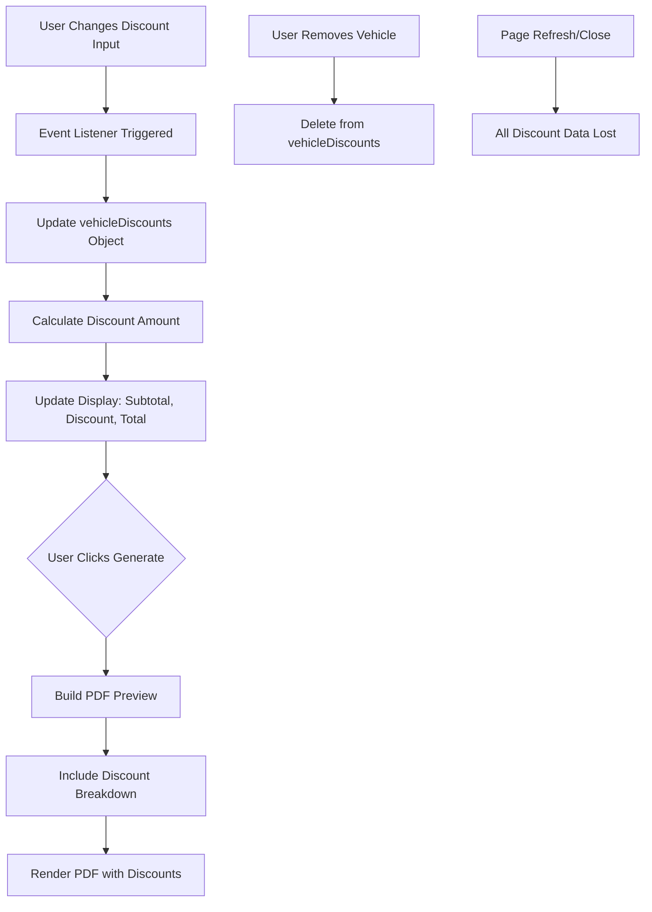

# Design Document: Quotation Discount Feature

## Overview

This design adds per-vehicle discount functionality to the quotation builder (`vehicles/quotation_builder.php`). Users can apply percentage or fixed-amount discounts to individual vehicles within a quotation. Discounts are calculated in real-time using JavaScript and displayed in the generated PDF, but are never persisted to the database.

The implementation follows these principles:
- **Client-side only**: All discount data lives in JavaScript objects during the session
- **Per-vehicle independence**: Each vehicle block maintains its own discount settings
- **Real-time feedback**: Discount calculations update immediately on input change
- **Dark theme consistency**: UI matches the existing booking discount feature styling
- **No database changes**: Discounts are temporary and used only for PDF generation

## Architecture

### Component Structure

```
vehicles/quotation_builder.php
├── HTML Structure
│   ├── Vehicle Blocks (existing)
│   │   ├── Vehicle Details (name, model, year)
│   │   ├── Rental Rates List
│   │   └── [NEW] Discount Controls
│   ├── Charges Section (existing)
│   └── Quote Preview (existing)
│
└── JavaScript Layer
    ├── Vehicle Management (existing)
    ├── [NEW] Discount State Management
    │   └── vehicleDiscounts = { vehicleId: { type, value } }
    ├── [NEW] Discount Calculation Engine
    │   ├── calculateVehicleSubtotal()
    │   ├── calculateDiscountAmount()
    │   └── calculateDiscountedTotal()
    └── PDF Generation (modified)
        └── Include discount breakdown per vehicle
```

### Data Flow



### Permission Model

The feature inherits the existing permission check:
- **Required Permission**: `add_vehicles`
- **Check Location**: Line 5 of `quotation_builder.php`
- **Enforcement**: Page-level (no additional checks needed)

## Components and Interfaces

### 1. Discount Controls UI Component

**Location**: Inside each `.vehicle-block` in the vehicle template

**HTML Structure**:
```html
<div class="discount-controls mt-4 border-t border-mb-subtle/10 pt-4">
    <p class="text-mb-subtle text-xs uppercase tracking-wider mb-3">Vehicle Discount</p>
    <div class="flex gap-2">
        <select class="discount-type bg-mb-black border border-mb-subtle/20 rounded-lg px-3 py-2 text-white text-sm focus:outline-none focus:border-mb-accent w-28 flex-shrink-0">
            <option value="">None</option>
            <option value="percent">Percent %</option>
            <option value="amount">Fixed $</option>
        </select>
        <div class="discount-value-wrap flex-1 hidden">
            <input type="number" class="discount-value w-full bg-mb-black border border-mb-subtle/20 rounded-lg px-3 py-2 text-white text-sm focus:outline-none focus:border-mb-accent" 
                   step="0.01" min="0" placeholder="0.00">
        </div>
    </div>
    <div class="discount-preview hidden mt-2 text-xs space-y-1">
        <p class="text-mb-subtle">Subtotal: <span class="vehicle-subtotal">$0.00</span></p>
        <p class="text-green-400">Discount: <span class="vehicle-discount">-$0.00</span></p>
        <p class="text-white font-medium">Total: <span class="vehicle-total">$0.00</span></p>
    </div>
</div>
```

**Styling Reference**: Matches `reservations/show.php` lines 537-549
- Dropdown: `bg-mb-black border border-mb-subtle/20 rounded-lg px-3 py-2 text-white text-sm`
- Input: Same as dropdown with `focus:outline-none focus:border-mb-accent`
- Labels: `text-mb-subtle text-xs uppercase tracking-wider`

### 2. JavaScript Discount State Manager

**Data Structure**:
```javascript
// Global state object (inside IIFE scope)
const vehicleDiscounts = new Map();

// Structure per vehicle:
// vehicleId (string) => {
//   type: 'percent' | 'amount' | null,
//   value: number (0.00),
//   subtotal: number,
//   discountAmount: number,
//   total: number
// }
```

**Key Functions**:

```javascript
function getVehicleId(vehicleBlock) {
    // Generate unique ID based on DOM position or timestamp
    if (!vehicleBlock.dataset.vehicleId) {
        vehicleBlock.dataset.vehicleId = 'v-' + Date.now() + '-' + Math.random().toString(36).substr(2, 9);
    }
    return vehicleBlock.dataset.vehicleId;
}

function calculateVehicleSubtotal(vehicleBlock) {
    // Sum all rate prices for this vehicle
    const rates = Array.from(vehicleBlock.querySelectorAll('.rate-row'));
    let subtotal = 0;
    rates.forEach(row => {
        const price = parseFloat(row.querySelector('.rate-price')?.value || 0);
        if (price > 0) subtotal += price;
    });
    return subtotal;
}

function calculateDiscountAmount(subtotal, type, value) {
    if (!type || value <= 0) return 0;
    
    if (type === 'percent') {
        // Cap at 100%
        const percent = Math.min(value, 100);
        return (subtotal * percent) / 100;
    } else if (type === 'amount') {
        // Cap at subtotal
        return Math.min(value, subtotal);
    }
    return 0;
}

function updateVehicleDiscount(vehicleBlock) {
    const vehicleId = getVehicleId(vehicleBlock);
    const typeSelect = vehicleBlock.querySelector('.discount-type');
    const valueInput = vehicleBlock.querySelector('.discount-value');
    const valueWrap = vehicleBlock.querySelector('.discount-value-wrap');
    const previewDiv = vehicleBlock.querySelector('.discount-preview');
    
    const type = typeSelect.value || null;
    const value = parseFloat(valueInput.value || 0);
    
    // Show/hide value input
    if (type) {
        valueWrap.classList.remove('hidden');
    } else {
        valueWrap.classList.add('hidden');
        valueInput.value = '';
    }
    
    // Calculate
    const subtotal = calculateVehicleSubtotal(vehicleBlock);
    const discountAmount = calculateDiscountAmount(subtotal, type, value);
    const total = subtotal - discountAmount;
    
    // Store in state
    vehicleDiscounts.set(vehicleId, {
        type,
        value,
        subtotal,
        discountAmount,
        total
    });
    
    // Update preview display
    if (type && discountAmount > 0) {
        previewDiv.classList.remove('hidden');
        vehicleBlock.querySelector('.vehicle-subtotal').textContent = '$' + subtotal.toFixed(2);
        vehicleBlock.querySelector('.vehicle-discount').textContent = '-$' + discountAmount.toFixed(2);
        vehicleBlock.querySelector('.vehicle-total').textContent = '$' + total.toFixed(2);
    } else {
        previewDiv.classList.add('hidden');
    }
}
```

### 3. Event Binding

**Attach to Vehicle Template**:
```javascript
function addVehicle() {
    const node = vehicleTemplate.content.cloneNode(true);
    const block = node.querySelector('.vehicle-block');
    const rateList = block.querySelector('.rate-list');
    
    // Existing bindings
    block.querySelector('.add-rate').addEventListener('click', () => addRateRow(rateList));
    block.querySelector('.remove-vehicle').addEventListener('click', () => {
        const vehicleId = getVehicleId(block);
        vehicleDiscounts.delete(vehicleId); // Clean up state
        block.remove();
    });
    
    // NEW: Discount bindings
    const typeSelect = block.querySelector('.discount-type');
    const valueInput = block.querySelector('.discount-value');
    
    typeSelect.addEventListener('change', () => updateVehicleDiscount(block));
    valueInput.addEventListener('input', () => updateVehicleDiscount(block));
    
    // Also recalculate discount when rates change
    rateList.addEventListener('input', () => {
        if (vehicleDiscounts.has(getVehicleId(block))) {
            updateVehicleDiscount(block);
        }
    });
    
    addRateRow(rateList);
    vehicleList.appendChild(node);
}
```

### 4. PDF Generation Integration

**Modified `buildPreview()` Function**:

The existing function collects vehicle data around line 220. We'll enhance it to include discount information:

```javascript
const vehicleData = vehicles.map((block, idx) => {
    const vehicleId = getVehicleId(block);
    const name = block.querySelector('.vehicle-name')?.value.trim() || 'Vehicle ' + (idx + 1);
    const model = block.querySelector('.vehicle-model')?.value.trim() || '';
    const year = block.querySelector('.vehicle-year')?.value.trim() || '';
    
    const rates = Array.from(block.querySelectorAll('.rate-row')).map(row => {
        const type = row.querySelector('.rate-type')?.value.trim() || '';
        const price = row.querySelector('.rate-price')?.value.trim() || '';
        const f = fmt(price);
        return { type: type || 'Rental', price: f };
    }).filter(r => r.price);
    
    // NEW: Get discount data
    const discountData = vehicleDiscounts.get(vehicleId) || null;
    
    return { name, model, year, rates, discount: discountData };
});
```

**PDF Table Rendering** (per vehicle):

```javascript
// After rendering all rate rows, add discount section if applicable
if (v.discount && v.discount.discountAmount > 0) {
    const subtotal = v.discount.subtotal.toFixed(2);
    const discountAmt = v.discount.discountAmount.toFixed(2);
    const total = v.discount.total.toFixed(2);
    
    // Discount label
    let discountLabel = 'Discount';
    if (v.discount.type === 'percent') {
        discountLabel += ` (${v.discount.value}%)`;
    } else {
        discountLabel += ` (Fixed)`;
    }
    
    h += `
        <tr style="background:#fff; border-top:2px solid #ccc;">
            <td style="padding:8px 10px; text-align:right; font-weight:bold;">Subtotal</td>
            <td style="padding:8px 10px; text-align:right;"></td>
            <td style="padding:8px 10px; text-align:right; font-weight:bold;">$${subtotal}</td>
        </tr>
        <tr style="background:#f0f0f0;">
            <td style="padding:8px 10px; text-align:right; color:#16a34a;">${esc(discountLabel)}</td>
            <td style="padding:8px 10px; text-align:right;"></td>
            <td style="padding:8px 10px; text-align:right; color:#16a34a; font-weight:bold;">-$${discountAmt}</td>
        </tr>
        <tr style="background:#111; color:#fff;">
            <td style="padding:8px 10px; text-align:right; font-weight:bold;">TOTAL</td>
            <td style="padding:8px 10px; text-align:right;"></td>
            <td style="padding:8px 10px; text-align:right; font-weight:bold;">$${total}</td>
        </tr>
    `;
} else {
    // No discount - just show rates as before
}
```

### 5. Grand Total Calculation

The existing `buildPreview()` calculates a grand total by summing all rates + charges. With discounts, we need to:

1. Sum discounted vehicle totals (not raw rates)
2. Add delivery, return, and additional charges

```javascript
let grandTotal = 0;

// Add vehicle totals (with discounts applied)
vehicleData.forEach(v => {
    if (v.discount && v.discount.total > 0) {
        grandTotal += v.discount.total;
    } else {
        // No discount - sum rates
        v.rates.forEach(r => {
            if (r.price) grandTotal += parseFloat(r.price);
        });
    }
});

// Add charges
grandTotal += parseFloat(deliveryVal);
grandTotal += parseFloat(returnVal);
if (extraEnabled && extraVal) grandTotal += parseFloat(extraVal);
```

## Data Models

### Discount State Object

```typescript
interface VehicleDiscount {
    type: 'percent' | 'amount' | null;
    value: number;           // Raw input value
    subtotal: number;        // Sum of all rates for this vehicle
    discountAmount: number;  // Calculated discount (capped)
    total: number;           // subtotal - discountAmount
}

// Runtime storage
const vehicleDiscounts: Map<string, VehicleDiscount>;
```

**Lifecycle**:
- **Created**: When user selects a discount type
- **Updated**: On any change to discount inputs or rate prices
- **Deleted**: When vehicle block is removed
- **Destroyed**: On page close/refresh (no persistence)

### Validation Rules

```javascript
function validateDiscount(type, value, subtotal) {
    if (!type || value <= 0) return { valid: true, capped: 0 };
    
    if (type === 'percent') {
        const capped = Math.min(Math.max(value, 0), 100);
        return { valid: true, capped };
    }
    
    if (type === 'amount') {
        const capped = Math.min(Math.max(value, 0), subtotal);
        return { valid: true, capped };
    }
    
    return { valid: false, capped: 0 };
}
```

## Error Handling

### Input Validation

1. **Negative Values**: Prevented by `min="0"` attribute on input
2. **Non-numeric Input**: Handled by `type="number"` and `parseFloat()` with fallback to 0
3. **Percent > 100%**: Capped at 100 in `calculateDiscountAmount()`
4. **Amount > Subtotal**: Capped at subtotal in `calculateDiscountAmount()`

### Edge Cases

1. **No Rates Defined**: Subtotal = 0, discount = 0, no preview shown
2. **Discount Type Changed**: Value input hidden/shown, recalculation triggered
3. **Rate Modified After Discount Set**: Discount recalculated automatically via event listener
4. **Vehicle Removed**: Discount data deleted from Map
5. **Multiple Vehicles**: Each maintains independent discount state

### Error Display

No explicit error messages needed - the UI prevents invalid states:
- Input constraints prevent negative values
- Capping logic prevents excessive discounts
- Hidden inputs prevent incomplete data entry

## Testing Strategy

### Unit Testing Approach

Unit tests will focus on specific calculation functions and edge cases:

**Test File**: `tests/quotation_discount_test.php` (PHP) or inline JavaScript tests

**Example Unit Tests**:
```javascript
// Test 1: Percent discount calculation
assert(calculateDiscountAmount(1000, 'percent', 10) === 100);
assert(calculateDiscountAmount(1000, 'percent', 150) === 1000); // Capped at 100%

// Test 2: Fixed amount discount calculation
assert(calculateDiscountAmount(1000, 'amount', 500) === 500);
assert(calculateDiscountAmount(1000, 'amount', 1500) === 1000); // Capped at subtotal

// Test 3: No discount
assert(calculateDiscountAmount(1000, null, 10) === 0);
assert(calculateDiscountAmount(1000, 'percent', 0) === 0);

// Test 4: Subtotal calculation
// Mock vehicle block with rates [100, 200, 300]
assert(calculateVehicleSubtotal(mockBlock) === 600);

// Test 5: Vehicle removal cleans up state
// Add vehicle, set discount, remove vehicle
assert(!vehicleDiscounts.has(removedVehicleId));
```

### Property-Based Testing Configuration

**Library**: Use `fast-check` for JavaScript property-based testing (can be run in Node.js environment)

**Configuration**:
- Minimum 100 iterations per property test
- Each test tagged with feature name and property number
- Tests run in isolation (no DOM dependencies where possible)

**Test File**: `tests/quotation_discount_properties.test.js`


## Correctness Properties

*A property is a characteristic or behavior that should hold true across all valid executions of a system—essentially, a formal statement about what the system should do. Properties serve as the bridge between human-readable specifications and machine-verifiable correctness guarantees.*

### Property 1: Discount Validation and Capping

*For any* vehicle subtotal and discount input (type and value), the calculated discount amount must be non-negative, and when the discount type is "percent" the value must be capped at 100%, and when the discount type is "amount" the value must be capped at the subtotal.

**Validates: Requirements 2.1, 2.2, 2.3**

### Property 2: Percent Discount Calculation

*For any* vehicle subtotal and valid percentage value (0-100), when the discount type is "percent", the discount amount must equal (subtotal × percentage ÷ 100) rounded to 2 decimal places.

**Validates: Requirements 3.2, 3.5**

### Property 3: Fixed Amount Discount Calculation

*For any* vehicle subtotal and valid amount value (0 to subtotal), when the discount type is "amount", the discount amount must equal the amount value rounded to 2 decimal places.

**Validates: Requirements 3.3, 3.5**

### Property 4: Discount Recalculation on Change

*For any* vehicle block with a discount set, when either the discount type, discount value, or any rate price changes, the discount amount and discounted total must be recalculated immediately.

**Validates: Requirements 3.1**

### Property 5: Discounted Total Calculation

*For any* vehicle with rates and a discount, the discounted total must equal the subtotal (sum of all rates) minus the discount amount, rounded to 2 decimal places.

**Validates: Requirements 3.4, 4.5**

### Property 6: Vehicle Discount Independence

*For any* quotation with multiple vehicles, setting or changing the discount on one vehicle must not affect the discount settings or calculations of any other vehicle.

**Validates: Requirements 6.1**

### Property 7: Discount Cleanup on Vehicle Removal

*For any* vehicle block with a discount, when that vehicle is removed from the quotation, its discount data must be deleted from the discount state storage.

**Validates: Requirements 6.3**

### Property 8: Discount Persistence Through Preview

*For any* vehicle with a discount set, when the quotation preview is generated, the discount settings must remain unchanged and available for subsequent operations.

**Validates: Requirements 6.4**

### Property 9: PDF Discount Inclusion

*For any* vehicle with a non-zero discount applied, the generated PDF must include a discount line for that vehicle.

**Validates: Requirements 4.1**

### Property 10: PDF Discount Breakdown Format

*For any* vehicle with a discount in the PDF, the discount section must display the subtotal, the discount amount with type indicator (percentage or "Fixed"), and the discount amount as a negative value or clearly marked deduction.

**Validates: Requirements 4.2, 4.3, 4.4**

### Property 11: Monetary Precision

*For any* monetary calculation (subtotal, discount amount, or discounted total), the result must be rounded to exactly 2 decimal places.

**Validates: Requirements 3.5**


## Testing Strategy

### Dual Testing Approach

This feature requires both unit tests and property-based tests to ensure comprehensive coverage:

- **Unit tests**: Verify specific examples, edge cases (zero discount, null type), UI element presence, and PDF generation for specific scenarios
- **Property tests**: Verify universal properties across all possible discount values, subtotals, and vehicle configurations

Both testing approaches are complementary and necessary. Unit tests catch concrete bugs in specific scenarios, while property tests verify general correctness across the input space.

### Unit Testing

**Test File**: `tests/quotation_discount_unit.test.js`

**Focus Areas**:
1. **UI Element Presence** (Requirements 1.1-1.4):
   - Test that discount controls are present in vehicle blocks
   - Test that dropdown has correct options
   - Test initial state (null type, 0 value)

2. **Edge Cases** (Requirement 2.4):
   - Test discount with value = 0 (should not apply)
   - Test discount with type = null (should not apply)
   - Test vehicle with no rates (subtotal = 0)

3. **PDF Generation Examples** (Requirement 4.6):
   - Test PDF for vehicle without discount (no discount lines)
   - Test PDF for vehicle with percent discount
   - Test PDF for vehicle with fixed amount discount

4. **State Cleanup**:
   - Test that removing a vehicle deletes its discount data
   - Test that adding a new vehicle initializes clean discount state

**Example Unit Test**:
```javascript
test('Vehicle with zero discount value should not show discount in PDF', () => {
    const vehicle = createMockVehicle({ rates: [100, 200] });
    setDiscount(vehicle, 'percent', 0);
    const pdf = generatePDF([vehicle]);
    assert(!pdf.includes('Discount'));
});
```

### Property-Based Testing

**Library**: `fast-check` (JavaScript property-based testing library)

**Test File**: `tests/quotation_discount_properties.test.js`

**Configuration**:
- Each property test runs minimum 100 iterations
- Use `fc.assert(fc.property(...), { numRuns: 100 })`
- Each test tagged with comment: `// Feature: quotation-discount, Property {N}: {description}`

**Property Test Implementations**:

#### Property 1: Discount Validation and Capping
```javascript
// Feature: quotation-discount, Property 1: Discount Validation and Capping
fc.assert(
    fc.property(
        fc.float({ min: 0, max: 10000 }), // subtotal
        fc.oneof(fc.constant('percent'), fc.constant('amount')),
        fc.float({ min: -100, max: 500 }) // value (including invalid negatives)
    ),
    (subtotal, type, value) => {
        const discount = calculateDiscountAmount(subtotal, type, value);
        
        // Must be non-negative
        assert(discount >= 0);
        
        // Percent capped at 100%
        if (type === 'percent') {
            assert(discount <= subtotal);
        }
        
        // Amount capped at subtotal
        if (type === 'amount') {
            assert(discount <= subtotal);
        }
        
        return true;
    },
    { numRuns: 100 }
);
```

#### Property 2: Percent Discount Calculation
```javascript
// Feature: quotation-discount, Property 2: Percent Discount Calculation
fc.assert(
    fc.property(
        fc.float({ min: 0, max: 10000 }), // subtotal
        fc.float({ min: 0, max: 100 })    // valid percentage
    ),
    (subtotal, percent) => {
        const discount = calculateDiscountAmount(subtotal, 'percent', percent);
        const expected = Math.round((subtotal * percent / 100) * 100) / 100;
        
        assert(Math.abs(discount - expected) < 0.01); // Allow floating point tolerance
        
        return true;
    },
    { numRuns: 100 }
);
```

#### Property 3: Fixed Amount Discount Calculation
```javascript
// Feature: quotation-discount, Property 3: Fixed Amount Discount Calculation
fc.assert(
    fc.property(
        fc.float({ min: 0, max: 10000 }), // subtotal
        fc.float({ min: 0, max: 10000 })  // amount
    ),
    (subtotal, amount) => {
        const discount = calculateDiscountAmount(subtotal, 'amount', amount);
        const expected = Math.min(amount, subtotal);
        const rounded = Math.round(expected * 100) / 100;
        
        assert(Math.abs(discount - rounded) < 0.01);
        
        return true;
    },
    { numRuns: 100 }
);
```

#### Property 5: Discounted Total Calculation
```javascript
// Feature: quotation-discount, Property 5: Discounted Total Calculation
fc.assert(
    fc.property(
        fc.array(fc.float({ min: 0, max: 1000 }), { minLength: 1, maxLength: 10 }), // rates
        fc.oneof(fc.constant('percent'), fc.constant('amount')),
        fc.float({ min: 0, max: 100 })
    ),
    (rates, type, value) => {
        const subtotal = rates.reduce((sum, r) => sum + r, 0);
        const discount = calculateDiscountAmount(subtotal, type, value);
        const total = subtotal - discount;
        
        // Total must be non-negative
        assert(total >= 0);
        
        // Total must be <= subtotal
        assert(total <= subtotal);
        
        // Total must be rounded to 2 decimals
        assert(total === Math.round(total * 100) / 100);
        
        return true;
    },
    { numRuns: 100 }
);
```

#### Property 6: Vehicle Discount Independence
```javascript
// Feature: quotation-discount, Property 6: Vehicle Discount Independence
fc.assert(
    fc.property(
        fc.array(fc.record({
            rates: fc.array(fc.float({ min: 0, max: 1000 }), { minLength: 1, maxLength: 5 }),
            discountType: fc.oneof(fc.constant('percent'), fc.constant('amount')),
            discountValue: fc.float({ min: 0, max: 100 })
        }), { minLength: 2, maxLength: 5 })
    ),
    (vehicles) => {
        // Set discounts for all vehicles
        const discountsBefore = vehicles.map((v, i) => {
            const vehicleId = 'v-' + i;
            const subtotal = v.rates.reduce((sum, r) => sum + r, 0);
            const discount = calculateDiscountAmount(subtotal, v.discountType, v.discountValue);
            return { vehicleId, discount };
        });
        
        // Modify first vehicle's discount
        const newDiscount = calculateDiscountAmount(
            vehicles[0].rates.reduce((sum, r) => sum + r, 0),
            'percent',
            50
        );
        
        // Verify other vehicles' discounts unchanged
        for (let i = 1; i < vehicles.length; i++) {
            const subtotal = vehicles[i].rates.reduce((sum, r) => sum + r, 0);
            const currentDiscount = calculateDiscountAmount(subtotal, vehicles[i].discountType, vehicles[i].discountValue);
            assert(Math.abs(currentDiscount - discountsBefore[i].discount) < 0.01);
        }
        
        return true;
    },
    { numRuns: 100 }
);
```

#### Property 11: Monetary Precision
```javascript
// Feature: quotation-discount, Property 11: Monetary Precision
fc.assert(
    fc.property(
        fc.float({ min: 0, max: 10000 }),
        fc.oneof(fc.constant('percent'), fc.constant('amount')),
        fc.float({ min: 0, max: 100 })
    ),
    (subtotal, type, value) => {
        const discount = calculateDiscountAmount(subtotal, type, value);
        const total = subtotal - discount;
        
        // Check 2 decimal places
        const discountStr = discount.toFixed(2);
        const totalStr = total.toFixed(2);
        
        assert(parseFloat(discountStr) === discount);
        assert(parseFloat(totalStr) === total);
        
        return true;
    },
    { numRuns: 100 }
);
```

### Integration Testing

**Manual Testing Checklist**:
1. Add multiple vehicles with different discounts
2. Modify rates after setting discount (verify recalculation)
3. Remove vehicle with discount (verify cleanup)
4. Generate PDF and verify discount breakdown format
5. Test with edge values (0%, 100%, amount = subtotal)
6. Verify dark theme styling matches booking discount

### Test Execution

**Running Tests**:
```bash
# Unit tests
npm test tests/quotation_discount_unit.test.js

# Property tests
npm test tests/quotation_discount_properties.test.js

# All tests
npm test tests/quotation_discount*.test.js
```

**Expected Coverage**:
- Unit tests: ~30-40 tests covering specific scenarios
- Property tests: 7 properties × 100 iterations = 700 test cases
- Total: ~730+ test executions per run
