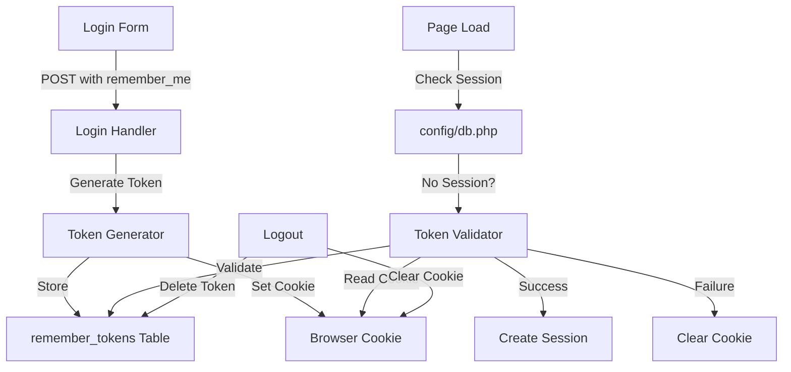

# Design Document: Remember Me Login

## Overview

This feature implements persistent authentication for the oRentPHP system using a secure token-based "Remember Me" mechanism. The implementation follows the selector/validator pattern, which is considered the industry standard for secure persistent login tokens.

### Current State

The oRentPHP system uses PHP sessions for authentication. Sessions expire when the browser closes, requiring users to re-authenticate on every visit. The login flow is handled in `auth/login.php`, session initialization occurs in `config/db.php`, and logout is managed in `auth/logout.php`.

### Proposed Solution

We will implement a dual-token system where:
- A **selector** (16 random bytes) acts as a database lookup key, stored in plaintext
- A **validator** (32 random bytes) acts as the authentication secret, hashed before storage
- Both are combined as `selector:validator` and stored in a secure cookie
- On page load, if no session exists, the system validates the token and auto-logs the user in

This approach prevents timing attacks, protects against database compromise, and supports multi-device usage.

### Key Design Decisions

1. **Selector/Validator Pattern**: Separating lookup (selector) from authentication (validator) prevents timing attacks during database queries and ensures that even if the database is compromised, tokens cannot be used without the validator.

2. **Token Storage**: Validators are hashed using `password_hash()` with `PASSWORD_DEFAULT` (currently bcrypt, future-proof). This ensures that database compromise doesn't expose usable tokens.

3. **Cookie Security**: HttpOnly prevents XSS attacks, Secure ensures HTTPS-only transmission, SameSite=Lax prevents CSRF while allowing normal navigation.

4. **Multi-Device Support**: Each device gets its own token. Logout only clears the current device's token. Password changes invalidate all tokens.

5. **Token Limit**: Maximum 5 active tokens per user prevents unlimited token accumulation. Oldest tokens are deleted when the limit is reached.

6. **Integration Point**: Token validation runs in `config/db.php` after `session_start()` but before any page logic, ensuring transparent operation across the entire application.

## Architecture

### Component Diagram



### Data Flow

1. **Login with Remember Me**:
   - User submits login form with "Remember Me" checked
   - System validates credentials
   - Token Generator creates selector (16 bytes) and validator (32 bytes)
   - Validator is hashed and stored in database with selector, user_id, and expiry
   - Combined `selector:validator` is stored in secure cookie (30-day expiry)
   - User is redirected to dashboard

2. **Auto-Login on Return Visit**:
   - Page loads, `config/db.php` runs after `session_start()`
   - If session exists, skip token validation
   - If no session, check for `remember_token` cookie
   - Extract selector and validator from cookie
   - Look up token by selector in database
   - Verify validator using `password_verify()` against stored hash
   - Check expiry timestamp
   - If valid, create session with user data and permissions
   - If invalid/expired, delete token and clear cookie

3. **Logout**:
   - Extract selector from cookie
   - Delete token record from database
   - Clear cookie by setting past expiry
   - Destroy session

### Security Considerations

1. **Timing Attack Prevention**: Using `password_verify()` provides constant-time comparison. Database lookups use indexed selector, not validator.

2. **Token Compromise Detection**: If a selector is found but validator fails verification, all tokens for that user are deleted (indicates potential token theft).

3. **Database Compromise Protection**: Validators are hashed, so stolen database doesn't reveal usable tokens.

4. **XSS Protection**: HttpOnly flag prevents JavaScript access to cookie.

5. **CSRF Protection**: SameSite=Lax prevents cross-site cookie transmission while allowing normal navigation.

6. **Token Rotation**: New tokens are generated on each login, even if old tokens exist.

## Components and Interfaces

### 1. Database Table: `remember_tokens`

**Purpose**: Store hashed remember tokens with metadata

**Schema**:
```sql
CREATE TABLE remember_tokens (
    id INT AUTO_INCREMENT PRIMARY KEY,
    user_id INT NOT NULL,
    selector VARCHAR(32) NOT NULL UNIQUE,
    validator_hash VARCHAR(255) NOT NULL,
    expires_at DATETIME NOT NULL,
    created_at DATETIME DEFAULT CURRENT_TIMESTAMP,
    FOREIGN KEY (user_id) REFERENCES users(id) ON DELETE CASCADE,
    INDEX idx_selector (selector),
    INDEX idx_expires_at (expires_at),
    INDEX idx_user_id (user_id)
);
```

**Indexes**:
- `selector`: Unique index for fast lookup during validation
- `expires_at`: Index for efficient cleanup queries
- `user_id`: Index for user-specific operations (delete all tokens, count tokens)

### 2. Login Form Modification (`auth/login.php`)

**Changes**:
- Add checkbox input after password field
- Process `remember_me` POST parameter
- Call token generation function if checked
- Set secure cookie with token

**Interface**:
```php
// Input
$_POST['remember_me'] // 'on' if checked, absent if not

// Output
setcookie('remember_token', $token_value, [
    'expires' => time() + (30 * 86400),
    'path' => '/',
    'httponly' => true,
    'secure' => true, // if HTTPS
    'samesite' => 'Lax'
]);
```

### 3. Token Generator

**Purpose**: Create cryptographically secure tokens

**Function Signature**:
```php
function generate_remember_token(int $user_id): array
```

**Returns**:
```php
[
    'selector' => string,      // 32-char hex (16 bytes)
    'validator' => string,     // 64-char hex (32 bytes)
    'cookie_value' => string,  // selector:validator
    'expires_at' => string     // SQL datetime (now + 30 days)
]
```

**Implementation**:
- Use `random_bytes(16)` for selector
- Use `random_bytes(32)` for validator
- Convert to hex using `bin2hex()`
- Hash validator with `password_hash($validator, PASSWORD_DEFAULT)`
- Store in database: user_id, selector, hashed_validator, expires_at
- Return cookie value as `selector:validator`

### 4. Token Validator (`config/db.php`)

**Purpose**: Validate token and auto-login user

**Function Signature**:
```php
function validate_remember_token(): bool
```

**Logic**:
```php
// Skip if session already exists
if (isset($_SESSION['user'])) {
    return false;
}

// Check for cookie
if (!isset($_COOKIE['remember_token'])) {
    return false;
}

// Parse token
$parts = explode(':', $_COOKIE['remember_token'], 2);
if (count($parts) !== 2) {
    clear_remember_cookie();
    return false;
}

[$selector, $validator] = $parts;

// Look up token
$pdo = db();
$stmt = $pdo->prepare("
    SELECT user_id, validator_hash, expires_at 
    FROM remember_tokens 
    WHERE selector = ? 
    LIMIT 1
");
$stmt->execute([$selector]);
$token = $stmt->fetch();

if (!$token) {
    clear_remember_cookie();
    return false;
}

// Check expiry
if (strtotime($token['expires_at']) < time()) {
    delete_remember_token($selector);
    clear_remember_cookie();
    app_log('AUTH', "Remember token expired for user {$token['user_id']}");
    return false;
}

// Verify validator
if (!password_verify($validator, $token['validator_hash'])) {
    // Potential compromise - delete all user tokens
    delete_all_user_tokens($token['user_id']);
    clear_remember_cookie();
    app_log('AUTH', "Remember token validation failed for user {$token['user_id']} - all tokens deleted");
    return false;
}

// Valid token - create session
create_user_session($token['user_id']);
app_log('AUTH', "Auto-login successful via remember token for user {$token['user_id']}");
return true;
```

### 5. Token Management Functions

**Purpose**: Helper functions for token operations

**Functions**:

```php
// Delete specific token
function delete_remember_token(string $selector): void

// Delete all tokens for a user
function delete_all_user_tokens(int $user_id): void

// Count active tokens for a user
function count_user_tokens(int $user_id): int

// Delete oldest token for a user
function delete_oldest_user_token(int $user_id): void

// Clear remember cookie
function clear_remember_cookie(): void

// Cleanup expired tokens (for cron)
function cleanup_expired_tokens(): int
```

### 6. Session Creation Helper

**Purpose**: Create session from user_id (used by both login and auto-login)

**Function Signature**:
```php
function create_user_session(int $user_id, bool $is_remember_login = false): void
```

**Implementation**:
- Load user from database
- Load permissions
- Set `$_SESSION['user']` with same structure as manual login
- Set `$_SESSION['remember_me_login']` flag if auto-login

### 7. Logout Modification (`auth/logout.php`)

**Changes**:
- Check for `remember_token` cookie
- Extract selector
- Delete token from database
- Clear cookie
- Destroy session

## Data Models

### Remember Token Record

```php
[
    'id' => int,                    // Auto-increment primary key
    'user_id' => int,               // Foreign key to users table
    'selector' => string,           // 32-char hex, unique index
    'validator_hash' => string,     // Hashed validator (bcrypt)
    'expires_at' => string,         // SQL datetime (30 days from creation)
    'created_at' => string          // SQL datetime (auto-set)
]
```

### Cookie Structure

```
Name: remember_token
Value: {selector}:{validator}
Example: a1b2c3d4e5f6g7h8i9j0k1l2m3n4o5p6:q7r8s9t0u1v2w3x4y5z6a7b8c9d0e1f2g3h4i5j6k7l8m9n0o1p2q3r4s5t6u7v8
Expiry: 30 days from creation
Path: /
HttpOnly: true
Secure: true (if HTTPS)
SameSite: Lax
```

### Session Additions

```php
$_SESSION['remember_me_login'] = bool;  // true if logged in via token
```


## Correctness Properties

*A property is a characteristic or behavior that should hold true across all valid executions of a system—essentially, a formal statement about what the system should do. Properties serve as the bridge between human-readable specifications and machine-verifiable correctness guarantees.*

### Property Reflection

After analyzing all acceptance criteria, I identified the following redundancies:
- Properties 3.6 and 14.1 both test multi-device token storage (combined into Property 1)
- Properties 6.3, 15.2 test auto-login success logging (combined into Property 18)
- Properties 6.4, 15.3 test auto-login failure logging (combined into Property 19)
- Properties 7.3 and 14.3 both test device-specific logout (combined into Property 14)
- Properties 2.1 and 2.2 can be combined into a single property about token generation (Property 2)
- Properties 4.2, 4.3, 4.4, 4.5, 4.6 can be combined into a comprehensive cookie security property (Property 5)

### Property 1: Token Generation Round Trip

*For any* user login with "Remember Me" checked, generating a token and then validating it should successfully authenticate the user.

**Validates: Requirements 2.1, 2.2, 2.4, 2.5, 3.1, 3.2, 5.2, 5.4**

### Property 2: Token Selector and Validator Length

*For any* generated remember token, the selector should be exactly 32 hexadecimal characters (16 bytes) and the validator should be exactly 64 hexadecimal characters (32 bytes).

**Validates: Requirements 2.1, 2.2, 2.4**

### Property 3: Token Storage Integrity

*For any* stored remember token, the selector in the database should match the original selector, and the validator_hash should verify against the original validator using password_verify.

**Validates: Requirements 3.1, 3.2**

### Property 4: Token Expiry Calculation

*For any* created remember token, the expires_at timestamp should be exactly 30 days (2,592,000 seconds) from the created_at timestamp.

**Validates: Requirements 3.4**

### Property 5: Cookie Security Configuration

*For any* remember_token cookie created, it should have path="/", HttpOnly=true, SameSite="Lax", expiry of 30 days, and Secure=true when HTTPS is detected.

**Validates: Requirements 4.2, 4.3, 4.4, 4.5, 4.6**

### Property 6: Cookie Value Format

*For any* remember_token cookie, the value should match the pattern `{selector}:{validator}` where both parts are valid hexadecimal strings.

**Validates: Requirements 2.5, 4.7**

### Property 7: Session-Only Login Without Remember Me

*For any* login attempt where the "Remember Me" checkbox is unchecked, no remember_token cookie should be created and no token should be stored in the database.

**Validates: Requirements 1.5**

### Property 8: Multi-Device Token Support

*For any* user, creating a new remember token on a different device should not delete existing tokens (unless the 5-token limit is reached).

**Validates: Requirements 3.6, 14.1, 14.2**

### Property 9: Token Validation Skips When Session Exists

*For any* page load where an active session already exists, token validation should not be performed.

**Validates: Requirements 6.2**

### Property 10: Expired Token Cleanup

*For any* token with an expires_at timestamp in the past, validation should delete the token from the database and clear the cookie.

**Validates: Requirements 5.7, 8.1, 8.2**

### Property 11: Missing Selector Cleanup

*For any* remember_token cookie with a selector that doesn't exist in the database, the cookie should be cleared.

**Validates: Requirements 5.8**

### Property 12: Auto-Login Session Structure

*For any* successful auto-login via remember token, the created session should have the same structure (user data and permissions) as a manual login session.

**Validates: Requirements 5.5, 5.6**

### Property 13: Auto-Login Session Flag

*For any* successful auto-login via remember token, the session should have a `remember_me_login` flag set to true.

**Validates: Requirements 13.1**

### Property 14: Device-Specific Logout

*For any* logout action, only the current device's remember token should be deleted from the database, and only the current device's cookie should be cleared.

**Validates: Requirements 7.1, 7.2, 7.3, 7.4, 14.3**

### Property 15: Cookie Deletion Mechanism

*For any* remember_token cookie being cleared, the expiry should be set to a past date to ensure browser deletion.

**Validates: Requirements 7.5**

### Property 16: Token Limit Enforcement

*For any* user, the number of active (non-expired) remember tokens should never exceed 5.

**Validates: Requirements 12.4**

### Property 17: Oldest Token Deletion at Limit

*For any* user with 5 active tokens, creating a new token should delete the token with the oldest created_at timestamp.

**Validates: Requirements 12.5**

### Property 18: Token Creation Logging

*For any* remember token creation, a log entry should be created with category "AUTH" containing the user_id and expiry date.

**Validates: Requirements 15.1**

### Property 19: Auto-Login Success Logging

*For any* successful auto-login via remember token, a log entry should be created with category "AUTH" containing the user_id and selector.

**Validates: Requirements 6.3, 15.2**

### Property 20: Auto-Login Failure Logging

*For any* failed auto-login attempt, a log entry should be created with category "AUTH" containing the failure reason.

**Validates: Requirements 6.4, 15.3, 15.4**

### Property 21: Validator Mismatch Security Response

*For any* token where the selector is found but password_verify fails, all remember tokens for that user should be deleted and a security warning should be logged.

**Validates: Requirements 12.7, 15.5**

### Property 22: Password Change Token Invalidation

*For any* user password change, all remember tokens for that user should be deleted from the database.

**Validates: Requirements 14.4**

### Property 23: New Token Generation on Each Login

*For any* login with "Remember Me" checked, a new token should be generated even if the user already has existing active tokens.

**Validates: Requirements 12.3**

### Property 24: No Password Data in Cookies

*For any* remember_token cookie, the value should not contain any password or password_hash data.

**Validates: Requirements 12.1**

### Property 25: Batch Expired Token Cleanup

*For any* call to the cleanup function, all tokens with expires_at timestamps older than the current time should be deleted.

**Validates: Requirements 8.3**

### Property 26: Graceful Database Error Handling

*For any* database error during token operations, the error should be logged and the page should continue to load without crashing.

**Validates: Requirements 15.7**

## Error Handling

### Token Validation Errors

1. **Missing Cookie**: If no `remember_token` cookie exists, skip validation silently (not an error).

2. **Malformed Cookie**: If cookie value doesn't match `selector:validator` pattern, clear cookie and log warning.

3. **Selector Not Found**: If selector doesn't exist in database, clear cookie (token was deleted or expired).

4. **Expired Token**: If token has expired, delete from database, clear cookie, log expiry event.

5. **Validator Mismatch**: If password_verify fails, delete ALL user tokens (security event), clear cookie, log security warning.

6. **Database Connection Error**: Catch PDOException, log error, skip validation, allow page to load normally.

### Token Generation Errors

1. **Random Bytes Failure**: If `random_bytes()` throws exception, log error, fall back to session-only login.

2. **Database Insert Failure**: If token insert fails, log error, clear cookie, continue with session-only login.

3. **Token Limit Enforcement Failure**: If oldest token deletion fails, log error, proceed with new token creation anyway.

### Logout Errors

1. **Cookie Parse Error**: If cookie value is malformed during logout, clear cookie anyway, log warning.

2. **Database Delete Failure**: If token deletion fails, log error, clear cookie anyway (cookie is primary security concern).

### Logging Strategy

All errors should be logged using `app_log('AUTH', $message, $context)` with:
- Error type
- User ID (if available)
- Token selector (if available)
- Exception message (if applicable)

Example:
```php
app_log('AUTH', 'Remember token validation failed: selector not found', [
    'selector' => $selector,
    'cookie_value_length' => strlen($_COOKIE['remember_token'])
]);
```

## Testing Strategy

### Dual Testing Approach

This feature requires both unit tests and property-based tests for comprehensive coverage:

**Unit Tests** focus on:
- Specific examples (e.g., login form displays checkbox)
- Edge cases (e.g., malformed cookie values, database connection failures)
- Integration points (e.g., config/db.php integration, logout flow)
- Error conditions (e.g., expired tokens, missing selectors)

**Property-Based Tests** focus on:
- Universal properties across all inputs (e.g., token generation always produces correct lengths)
- Round-trip properties (e.g., generate token → validate token → successful auth)
- Invariants (e.g., user never has more than 5 active tokens)
- Security properties (e.g., cookies never contain passwords)

### Property-Based Testing Configuration

**Library**: Use [Eris](https://github.com/giorgiosironi/eris) for PHP property-based testing

**Configuration**:
- Minimum 100 iterations per property test
- Each test tagged with comment: `// Feature: remember-me-login, Property {number}: {property_text}`
- Use generators for: user IDs, token selectors, token validators, timestamps, cookie values

**Example Test Structure**:
```php
// Feature: remember-me-login, Property 1: Token Generation Round Trip
public function testTokenGenerationRoundTrip()
{
    $this->forAll(
        Generator\int(1, 1000), // user_id
        Generator\bool()        // is_https
    )
    ->then(function ($user_id, $is_https) {
        // Generate token
        $token = generate_remember_token($user_id);
        
        // Store in database
        store_remember_token($token);
        
        // Validate token
        $result = validate_remember_token($token['cookie_value']);
        
        // Assert successful validation
        $this->assertTrue($result);
        $this->assertEquals($user_id, $_SESSION['user']['id']);
    });
}
```

### Unit Test Coverage

1. **Login Form Tests**:
   - Checkbox renders with correct attributes
   - Checkbox is unchecked by default
   - Label text is "Remember me for 30 days"
   - Form submission with checkbox checked creates token
   - Form submission with checkbox unchecked doesn't create token

2. **Token Generation Tests**:
   - Selector is 32 hex characters
   - Validator is 64 hex characters
   - Cookie value format is `selector:validator`
   - Expiry is 30 days from creation
   - Multiple tokens can be created for same user

3. **Token Validation Tests**:
   - Valid token creates session
   - Expired token is deleted
   - Missing selector clears cookie
   - Validator mismatch deletes all user tokens
   - Existing session skips validation

4. **Logout Tests**:
   - Logout deletes current token
   - Logout clears cookie
   - Logout doesn't affect other device tokens

5. **Security Tests**:
   - Token limit enforced at 5
   - Oldest token deleted when limit reached
   - Password change deletes all tokens
   - Cookies have correct security flags

6. **Error Handling Tests**:
   - Malformed cookie handled gracefully
   - Database errors don't crash page
   - Random bytes failure falls back to session-only

### Integration Tests

1. **End-to-End Flow**:
   - Login with remember me → logout → return → auto-login
   - Login on device 1 → login on device 2 → both work
   - Login on 5 devices → 6th device deletes oldest

2. **Config/DB Integration**:
   - Token validation runs after session_start
   - Token validation runs before auth_check
   - Validation completes quickly (< 100ms)

3. **Multi-Device Scenarios**:
   - Device A logs in → Device B logs in → Device A still works
   - Device A logs out → Device B still works
   - Password change → both devices require re-login

### Test Data Generators

For property-based tests, create generators for:

```php
// User ID generator (1-10000)
Generator\int(1, 10000)

// Token selector generator (32 hex chars)
Generator\regex('[a-f0-9]{32}')

// Token validator generator (64 hex chars)
Generator\regex('[a-f0-9]{64}')

// Timestamp generator (past, present, future)
Generator\choose(
    Generator\int(time() - 86400 * 60, time() - 1),  // Past
    Generator\constant(time()),                       // Present
    Generator\int(time() + 1, time() + 86400 * 60)   // Future
)

// Cookie value generator
Generator\bind(
    Generator\regex('[a-f0-9]{32}'),
    function($selector) {
        return Generator\bind(
            Generator\regex('[a-f0-9]{64}'),
            function($validator) use ($selector) {
                return Generator\constant("$selector:$validator");
            }
        );
    }
)
```

### Manual Testing Checklist

1. Login with remember me → close browser → reopen → should be logged in
2. Login without remember me → close browser → reopen → should require login
3. Login on Chrome → login on Firefox → both should work
4. Login on 5 devices → 6th device should work, oldest should be invalidated
5. Logout on one device → other devices should still work
6. Change password → all devices should require re-login
7. Wait 30 days → token should expire and require re-login
8. Check logs for all auth events
9. Verify cookies have correct security flags (inspect in browser dev tools)
10. Test with HTTPS and HTTP (Secure flag should adapt)

